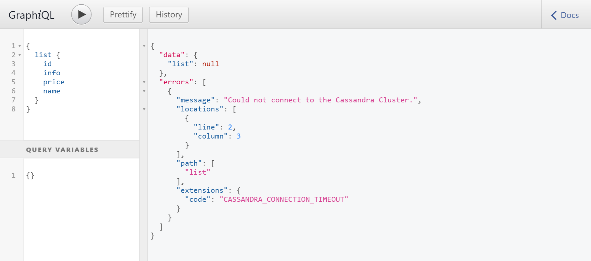
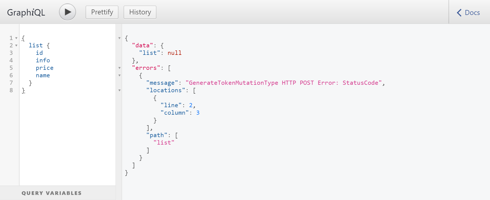

|                        |                              |
| -----------------------|-----------------------------------------|
| Title                  | Full-Stack error handling with React and GraphQL |
| Details                | talk on error handing in React and GraphQL. A deep dive into the practical error handling techniques widely adopted across the React and GraphQL ecosystem |
| Persentation Slides    | [Error Handling With React & GraphQL.pdf](https://github.com/gufranmirza/talks/blob/main/2019-react-graphql/Error%20Handling%20With%20React%20%26%20GraphQL.pdf)       |
| Meetup Link            | https://www.meetup.com/ReactJS-and-Friends/events/262800538/        |
| Recording              | N/A        |


## install deps
```
github.com/graphql-go/graphql
github.com/graphql-go/handler
```

## Run the example
```
go run main.go
// visit http://localhost:8080/graphql
```


### GraphQL Error With Status Codes (New Approach)



### GraphQL Error Without Status Codes (Older Approach)

